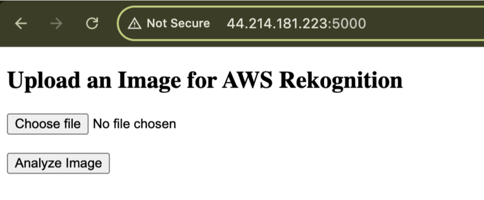
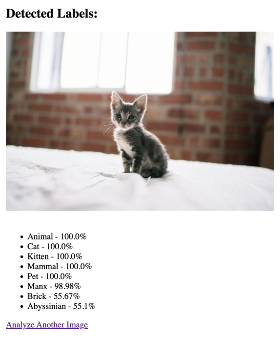
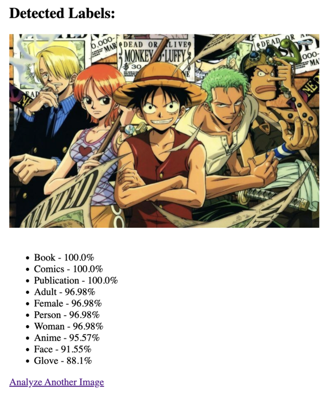
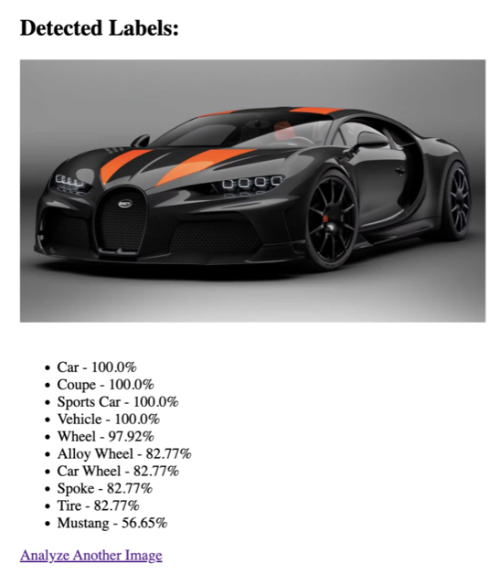

# 🚀 Flask AWS Rekognition App with EC2 Backup & Secure Access

## 📌 Project Overview

This project is a complete web-based image recognition system built with **Flask** and **AWS Rekognition**. Users can upload images, and the app detects objects, scenes, or concepts in them using Amazon Rekognition.

Additionally, the project demonstrates how to:
- Backup the EC2 instance using **Amazon Machine Images (AMIs)** and **Snapshots**
- Set up **secure access** using **SSH key pairs**

---

## ✨ Features

- Upload images via a web interface
- Detect labels using Amazon Rekognition
- Secure EC2 access via SSH key pairs
- Backup EC2 using AMIs and Snapshots
- Display uploaded image with recognition results
- Hosted Flask app on AWS EC2 instance

---

## ⚙️ Tools & Technologies Used

| Tool               | Purpose                                           |
|--------------------|---------------------------------------------------|
| **Flask**          | Web framework for the application                 |
| **Amazon Rekognition** | AI-powered image analysis                    |
| **EC2**            | Cloud server to host the Flask app                |
| **AMI**            | To create full instance backup                    |
| **EBS Snapshot**   | Backup of the volume (data storage)               |
| **SSH Key Pair**   | Secure access to EC2                              |
| **Git + GitHub**   | Version control and remote hosting                |

---

## 🛡️ EC2 Backup and Secure Access

### EC2 Backups Done With:

- Create Image → Generates AMI
- Create Snapshot → Stores EBS volume state

### Secure Access Achieved With:
- SSH key pair (.pem file)
- IAM Role with fine-grained Rekognition permissions

---

## 💾 How I Backed Up EC2

### ✅ Create an AMI (Full Instance Backup)
1. Go to EC2 → Instances  
2. Select your instance → **Actions** → **Image and Templates** → **Create Image**  
3. AMI includes **OS, configurations, EBS volumes**

### ✅ Create a Snapshot (Volume Backup)
1. Go to EC2 → Elastic Block Store → Volumes  
2. Select volume → **Actions** → **Create Snapshot**  
3. Snapshot captures only the volume (ideal for data-only backups)

---

## 📚 What I Learned

- Connecting Flask to AWS Rekognition using Boto3
- Managing EC2 and understanding cloud security basics
- Creating full and partial backups with AMIs and Snapshots
- Real-world deployment of Python apps on AWS

---

## 📂 Dependencies

Install these using pip:

```bash
pip3 install flask boto3
````

Upgrade pip:

```bash
python3 -m pip install --upgrade pip
```

---

## 🚀 How This Project Works

1. User uploads an image
2. Flask saves it temporarily
3. Image is sent to AWS Rekognition via Boto3
4. Rekognition returns labels
5. App displays image + detected labels in browser

---

## 🧪 Real-Time Example

**Uploaded Image:** Bugatti

**Detected Labels:**

* Car
* Sports Car
* Vehicle
* Alloy Wheel
* Tire

## 📸 Sample Output Screenshots

Below are some example screenshots of how the AWS Rekognition results look like in this project:

### 🖼️ Uploaded Image & Detected Labels

#### 🔹 Main Web Page


#### 🔹 Example 1


#### 🔹 Example 2


#### 🔹 Example 3


---

## 🛠️ How to Set Up This Project

### 1. SSH into your EC2 instance

```bash
ssh -i "your-key.pem" ec2-user@your-ec2-public-dns
```

### 2. Install system dependencies

```bash
sudo yum update -y
sudo yum install git python3 -y
```

### 3. Clone your GitHub repository

```bash
git clone https://github.com/zehra-stark/flask-rekognition-app.git
cd flask-rekognition-app
```

### 4. Install Python dependencies

```bash
pip3 install flask boto3
```

---

## ▶️ Run the Flask App

```bash
python3 app.py
```

Then open your browser and visit:

```text
http://<Your-EC2-Public-IP>:5000
```

---

## 👩‍💻 Author

**Nivetha Velmurugan**
🔗 [GitHub - zehra-stark]

---

## ✅ To Run This Project Yourself

```bash
git clone https://github.com/zehra-stark/flask-rekognition-app.git
cd flask-rekognition-app
pip3 install -r requirements.txt
python3 app.py
```

Visit in your browser:

```text
http://<Your-EC2-Public-IP>:5000
```

---
That's for today....!
